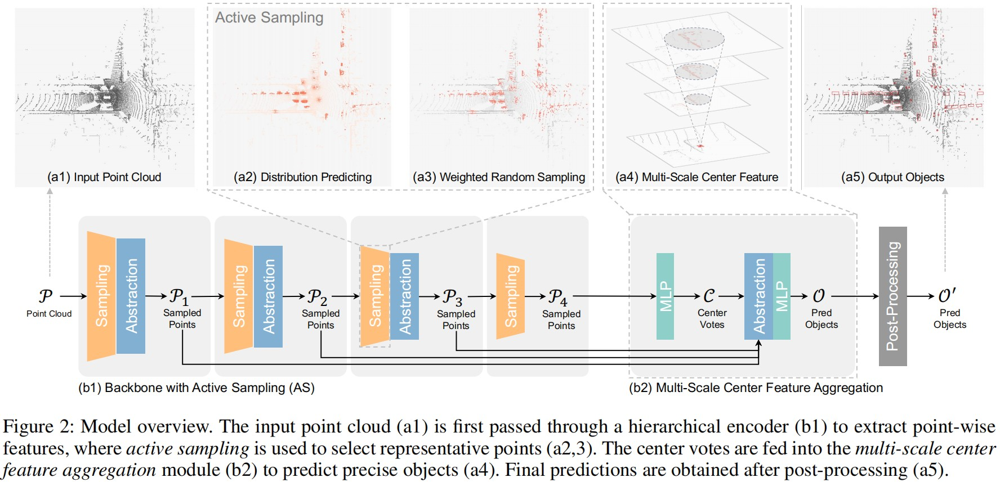

# AS-Det: Active Sampling for Adaptive 3D Object Detection in Point Clouds

[AS-Det](https://ojs.aaai.org/index.php/AAAI/article/view/32281) is a point-based single-stage 3D object detector available for LiDAR and 4D Radar.

This is the official repository.

<div >



</div>


## Getting Started

### Installation
**Step 1.** Create a conda environment and activate it.

```shell
conda create --name ASDet python=3.9
conda activate ASDet
```

**Step 2.** Install PyTorch.

```shell
conda install pytorch==1.12.1 torchvision==0.13.1 torchaudio==0.12.1 cudatoolkit=11.3 -c pytorch
```

**Step 3.** Install MMDetection3D.  

```shell
pip install -U openmim
mim install mmengine
mim install 'mmcv==2.0.1'
mim install 'mmdet==3.0.0'
mim install "mmdet3d==1.1.1"
```
You can get more detailed guidance and reference from their [official document](https://github.com/open-mmlab/mmdetection3d/blob/22aaa47fdb53ce1870ff92cb7e3f96ae38d17f61/docs/en/get_started.md).


**Step 4.** Install PyTorch3D.  

Run commands according to your CUDA version and OS.
```shell
conda install -c fvcore -c iopath -c conda-forge fvcore iopath
conda install -c bottler nvidiacub
# for CUDA < 11.7 above
conda install pytorch3d -c pytorch3d  # for linux
pip install "git+https://github.com/facebookresearch/pytorch3d.git"  # for other OS
```
You can also find more guidance from their [offcial document](https://github.com/facebookresearch/pytorch3d/blob/main/INSTALL.md).


**Step 5.** Install other requirements.

```shell
pip install -r requirements.txt
```

### Dataset preparation

#### KITTI
Please download and process the KITTI dataset following [here](https://mmdetection3d.readthedocs.io/en/latest/advanced_guides/datasets/kitti.html).

#### nuScenes
Please download and process the nuScenes dataset following [here](https://mmdetection3d.readthedocs.io/en/latest/advanced_guides/datasets/nuscenes.html).

**You can place the processed dataset folder anywhere you want, 
just remember to adjust the ```data_root``` parameter 
in the dataset config file (e.g. ```configs/_base_/datasets/kitti-3d.py```) accordingly.**


## Training
To train AS-Det on KITTI dataset, simply run the training script:
```shell
CUDA_VISIBLE_DEVICES=0 python tools/train.py configs/asdet/asdet_1xb16_kitti-3d.py --work-dir log_train/asdet_1xb16_kitti-3d
```

To train AS-Det on nuScenes dataset, utilize multiple GPUs for parallel training (DDP) to keep the batch size:
```shell
CUDA_VISIBLE_DEVICES=0,1,2,3 ./tools/dist_train.sh configs/asdet/asdet_4xb4_nus-3d.py 4 --work-dir log_train/asdet_4xb4_nus-3d
```

## Testing
To test AS-Det, you must provide a checkpoint corresponding to the config file.  
e.g.:
```shell
CUDA_VISIBLE_DEVICES=0 python tools/train.py configs/asdet/asdet_1xb16_kitti-3d.py /PATH/TO/CHECKPOINT --work-dir log_test/asdet_1xb16_kitti-3d
```


## Utils

### Tensorboard  
Tensorboard is supported by default. Run the script and access the visual log page using browser.
```shell
tensorboard --logdir=log_tb --port 6006  
```

## TODO list
 - [X] release main code
 - [X] release code for KITTI
 - [X] release code for nuScenes
 - [ ] release code for VoD


## Citation
If you find this work useful for your research, please cite our paper:
```
@inproceedings{ding2025det,
  title={AS-Det: Active Sampling for Adaptive 3D Object Detection in Point Clouds},
  author={Ding, Ziheng and Zhang, Xiaze and Jing, Qi and Cheng, Ying and Feng, Rui},
  booktitle={Proceedings of the AAAI Conference on Artificial Intelligence},
  volume={39},
  number={3},
  pages={2762--2770},
  year={2025}
}
```
